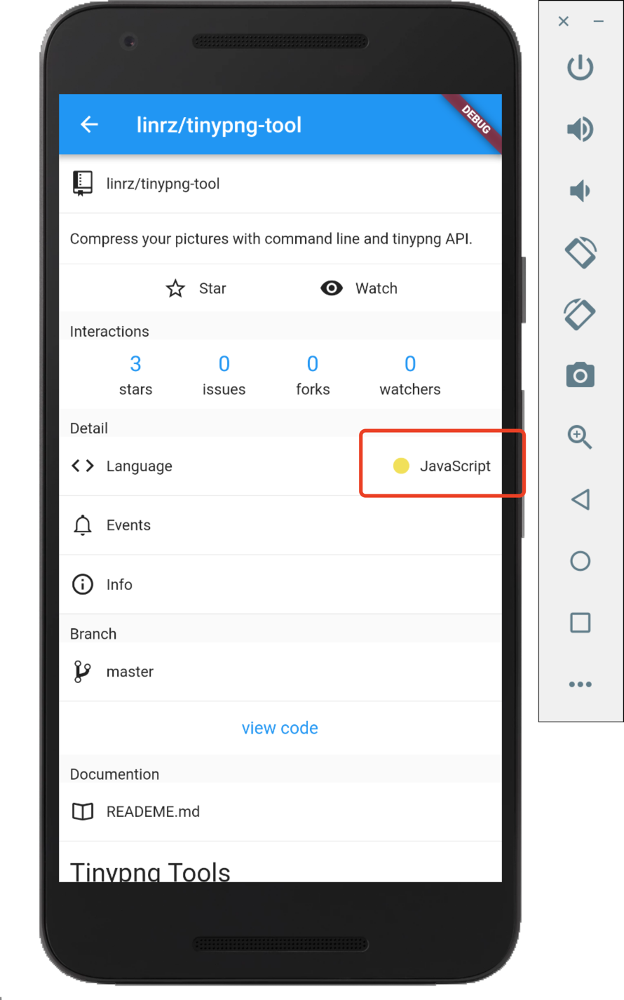

# github_colors

A Dart package for developers to covert languages colors in Github.

## Usage

Open your pubspec.yaml and add the following dependency.

```yaml
dependencies:
  github_colors: 0.0.1  #latest version
```

```dart
import 'package:github_colors/github_colors.dart';

main() {
  String hex = GithubColors.covert('JavaScript');
  print(hex); // #f1e05a
}
```

## Example


## Author
**github_colors** © [linrz](https://github.com/linrz), Released under the [MIT](./LICENSE) License.<br>
Authored and maintained by linrz.

> [github.com/linrz](https://github.com/linrz) · GitHub [@linrz](https://github.com/linrz) · Twitter [@linrzPro](https://twitter.com/linrzPro)

<br>

2019 © [linrz](https://github.com/linrz)